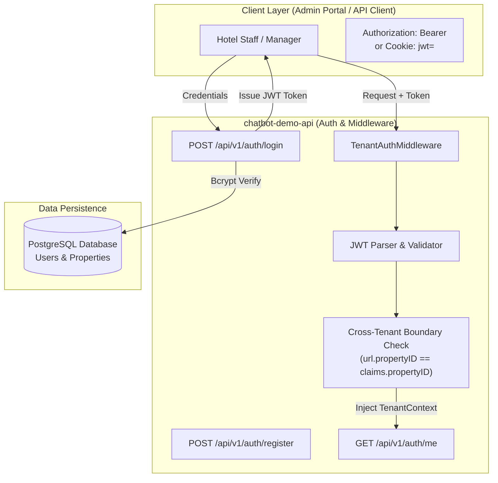
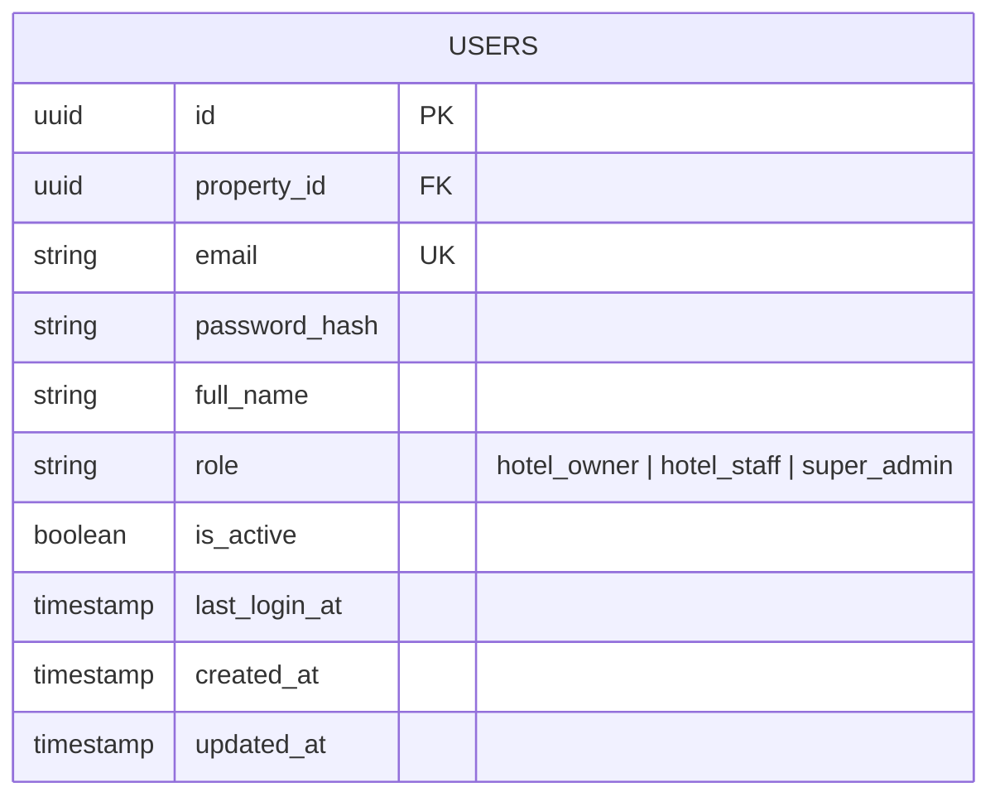

# Authentication & Multi-Tenant Security API Specification

The **Authentication & Multi-Tenant Security Module** provides user identity management, role-based access control (RBAC), multi-tenant property isolation, and JWT token issuance for the AI Hospitality Experience Platform.

It enables hotel managers and owners to register property accounts, log in securely via JWT Bearer tokens or `HttpOnly` cookies, retrieve authenticated user context, and enforce strict cross-tenant data boundaries across all API endpoints.

---

## 1. System Architecture & Tenant Security Flow



---

## 2. JWT Specifications & Claims Schema

### Token Payload
Access tokens are signed using **HMAC-SHA256** with a 24-hour expiration (`time.Now().Add(24 * time.Hour)`).

```json
{
  "user_id": "a1b2c3d4-e5f6-7a8b-9c0d-1e2f3a4b5c6d",
  "property_id": "a8360f9a-445f-405a-9725-232113f382b4",
  "email": "manager@grandoceanresort.com",
  "role": "hotel_owner",
  "exp": 1723380000,
  "iat": 1723293600
}
```

### Supported User Roles
- `hotel_owner` — Full administrative control over the assigned property, room types, outlets, bot config, and team members.
- `hotel_staff` — Concierge & operational access to chat history, guest inquiries, and room availability.
- `super_admin` — Platform super-administrator capable of managing across all hotel property tenants.

### Multi-Tenant Boundary Enforcement Rules
The `TenantAuthMiddleware` enforces hard tenant isolation boundaries:
1. **Extraction**: Accepts JWT token from either `Authorization: Bearer <token>` header or `jwt` HttpOnly cookie.
2. **Validation**: Verifies signature, issuer, and expiration.
3. **Cross-Tenant Guard**: If an API route contains a `{id}` property UUID parameter in the URL path (e.g. `/api/v1/properties/{id}/rooms`), the middleware asserts that `claims.PropertyID == path.PropertyID`.
4. **Rejection**: If a user attempts to access or mutate another property's data, the request is rejected with `HTTP 403 Forbidden` (`Access denied. You do not have permission to access data for another hotel property.`). Super-admins bypass this restriction.

---

## 3. Data Model Schema (`users` Table)



---

## 4. API Endpoint Specifications

### Base URL
```
http://localhost:8080/api/v1/auth
```

---

### 1. Register Hotel Tenant & Manager Account
Provisions a new hotel `Property` record and creates the initial `hotel_owner` administrator account.

* **HTTP Method**: `POST`
* **Path**: `/api/v1/auth/register`
* **Authentication**: None (Public Endpoint)
* **Headers**: `Content-Type: application/json`

#### Request Payload
```json
{
  "hotel_name": "Grand Ocean Resort & Spa",
  "email": "manager@grandoceanresort.com",
  "password": "SecurePassword123!",
  "full_name": "Kasun Perera",
  "city": "Galle",
  "country": "Sri Lanka"
}
```

#### Field Validation Rules
| Field | Type | Required | Description |
|---|---|---|---|
| `hotel_name` | String | Yes | Full commercial name of the hotel property. |
| `email` | String | Yes | Unique login email address. Must not already exist. |
| `password` | String | Yes | Account password. Automatically hashed using Bcrypt. |
| `full_name` | String | No | Full name of the property manager. Defaults to `"{hotel_name} Manager"`. |
| `city` | String | No | City location. Defaults to `"Default City"`. |
| `country` | String | No | Country location. Defaults to `"Default Country"`. |

#### Response Payload (`HTTP 201 Created`)
```json
{
  "status": "success",
  "message": "Hotel tenant registered successfully",
  "data": {
    "property_id": "a8360f9a-445f-405a-9725-232113f382b4",
    "user_id": "f47ac10b-58cc-4372-a567-0e02b2c3d4e5",
    "email": "manager@grandoceanresort.com",
    "full_name": "Kasun Perera",
    "property_name": "Grand Ocean Resort & Spa",
    "property_slug": "grand-ocean-resort-spa"
  }
}
```

#### Error Responses
- **`HTTP 400 Bad Request`**: Missing required fields (`hotel_name`, `email`, or `password`).
- **`HTTP 409 Conflict`**: An account with the specified email already exists.

---

### 2. User Authentication & Login
Authenticates user credentials, generates a 24-hour JWT access token, sets an `HttpOnly` session cookie, and updates `last_login_at`.

* **HTTP Method**: `POST`
* **Path**: `/api/v1/auth/login`
* **Authentication**: None (Public Endpoint)
* **Headers**: `Content-Type: application/json`

#### Request Payload
```json
{
  "email": "manager@grandoceanresort.com",
  "password": "SecurePassword123!"
}
```

#### Response Payload (`HTTP 200 OK`)
```json
{
  "status": "success",
  "message": "Login successful",
  "data": {
    "token": "eyJhbGciOiJIUzI1NiIsInR5cCI6IkpXVCJ9...",
    "user": {
      "id": "f47ac10b-58cc-4372-a567-0e02b2c3d4e5",
      "property_id": "a8360f9a-445f-405a-9725-232113f382b4",
      "email": "manager@grandoceanresort.com",
      "full_name": "Kasun Perera",
      "role": "hotel_owner",
      "property_name": "Grand Ocean Resort & Spa",
      "property_city": "Galle"
    }
  }
}
```

#### Response Headers & Cookies
```http
Set-Cookie: jwt=eyJhbGciOiJIUzI1NiIsInR5cCI6IkpXVCJ9...; Path=/; Expires=Mon, 11 Aug 2026 07:47:39 GMT; HttpOnly; SameSite=Lax
```

#### Error Responses
- **`HTTP 401 Unauthorized`**: Invalid email or incorrect password.
- **`HTTP 403 Forbidden`**: Account is deactivated (`is_active == false`).

---

### 3. Get Authenticated User Context (`/me`)
Retrieves profile details of the currently authenticated user and preloads their assigned property.

* **HTTP Method**: `GET`
* **Path**: `/api/v1/auth/me`
* **Authentication**: Required (`Bearer <JWT>` or `jwt` Cookie)

#### Response Payload (`HTTP 200 OK`)
```json
{
  "status": "success",
  "message": "Authenticated user profile retrieved",
  "data": {
    "user": {
      "id": "f47ac10b-58cc-4372-a567-0e02b2c3d4e5",
      "property_id": "a8360f9a-445f-405a-9725-232113f382b4",
      "email": "manager@grandoceanresort.com",
      "full_name": "Kasun Perera",
      "role": "hotel_owner",
      "is_active": true,
      "last_login_at": "2026-08-10T07:45:00Z",
      "created_at": "2026-08-01T12:00:00Z",
      "updated_at": "2026-08-10T07:45:00Z"
    },
    "property": {
      "id": "a8360f9a-445f-405a-9725-232113f382b4",
      "name": "Grand Ocean Resort & Spa",
      "slug": "grand-ocean-resort-spa",
      "city": "Galle",
      "country": "Sri Lanka",
      "star_rating": 5
    }
  }
}
```

#### Error Responses
- **`HTTP 401 Unauthorized`**: Missing, invalid, or expired JWT token.

---

### 4. Logout User Session
Clears the `jwt` HttpOnly cookie and invalidates client session state.

* **HTTP Method**: `POST`
* **Path**: `/api/v1/auth/logout`
* **Authentication**: None

#### Response Payload (`HTTP 200 OK`)
```json
{
  "status": "success",
  "message": "Successfully logged out"
}
```

#### Response Headers
```http
Set-Cookie: jwt=; Path=/; Expires=Thu, 01 Jan 1970 00:00:00 GMT; HttpOnly
```

---

## 5. Security Best Practices Implemented

1. **Password Hashing**: Passwords are saved strictly as Bcrypt salted hashes (never plain text).
2. **HttpOnly Cookie**: JWT token is attached as an `HttpOnly`, `SameSite=Lax` cookie to protect against Cross-Site Scripting (XSS) attacks.
3. **Strict Cross-Tenant Authorization**: Requests targeting `/api/v1/properties/{id}/*` verify that the property ID matches the authenticated token context.
4. **Context Injection**: Controllers retrieve tenant credentials safely from `r.Context()` without re-parsing raw headers.
