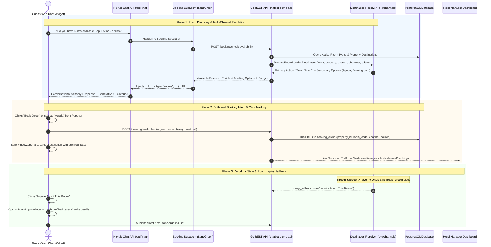

# Comprehensive Architecture: Room Reservation & Booking Subsystem

> **Document Version**: 3.0 (AURA V1 Release)  
> **Status**: Production Blueprint & Architecture Audit  
> **Location**: `docs/booking_and_reservation_flow.md`

---

## 1. Executive Summary

The **Room Reservation & Booking Subsystem** powers conversational, AI-assisted room recommendations, external booking routing, temporary inventory simulation, and inquiry capture for luxury hotels and resorts.

In **AURA V1**, the platform operates in **External Booking Engine Mode** (`booking_mode: "external"`), avoiding premature live two-way PMS inventory locks in favor of a robust, high-converting external booking workflow. Prospective guests interact with the AI concierge using natural sensory dialogue (e.g., *"ocean view with a plunge pool for our anniversary"*), inspect dynamic Generative UI cards, and are routed to the hotel's configured **Direct Website**, **Booking.com**, **Agoda**, **Expedia**, or custom booking portals, with seamless fallback to an **Inquiry Experience** when no booking link is configured.

```
Guest Message  ──►  LangGraph Agent (Booking Specialist)  ──►  Destination Resolver
                          │                                           │
                          ▼                                           ▼
                   Gemini 2.5 Flash                            Go REST API Backend
                          │                                           │
                          ▼                                           ▼
                 Dynamic Generative UI Cards                    4-Tier Precedence
            (RoomCarouselUI / DetailUI / Popover)        (Override > Property > OTA > Inquiry)
                          │                                           │
                          ▼                                           ▼
             Outbound Booking Click Tracking                Target Destination URL
                 (/booking/track-click)                  (Direct / Booking.com / Agoda)
```

---

## 2. End-to-End Sequence & Interaction Flow

The following Mermaid diagram illustrates the complete interaction lifecycle between the **Guest / Chat Widget**, **Next.js AI Agent Gateway**, **Go Backend API**, **Destination Resolver**, and **Database**.



---

## 3. The 4-Tier Destination Resolution Precedence Engine

When resolving booking links for any room category, the backend [`destination_resolver.go`](file:///Users/shakthirw/Downloads/Chatbot%20Demo/chatbot-demo-api/pkg/channels/destination_resolver.go) executes the following strict hierarchy:

```
┌─────────────────────────────────────────────────────────────┐
│ 1. Specific Room Override (Direct, Booking.com, Agoda, etc.)│ ◄── Tier 1 (Highest Priority)
└──────────────────────────────┬──────────────────────────────┘
                               │ (if room has no custom override)
                               ▼
┌─────────────────────────────────────────────────────────────┐
│ 2. Property-Level Configured Destinations (Integrations Hub)│ ◄── Tier 2 (Preferred Channel)
└──────────────────────────────┬──────────────────────────────┘
                               │ (if no property channels configured)
                               ▼
┌─────────────────────────────────────────────────────────────┐
│ 3. Legacy Automatic Booking.com Deep-Link Engine            │ ◄── Tier 3 (Universal Fallback)
└──────────────────────────────┬──────────────────────────────┘
                               │ (if property has no booking slug)
                               ▼
┌─────────────────────────────────────────────────────────────┐
│ 4. "Inquire About This Room" Modal Fallback                 │ ◄── Tier 4 (Zero-Link State)
└─────────────────────────────────────────────────────────────┘
```

---

## 4. Component Breakdown & Real vs. Simulated Status

This table provides a transparent audit of every component in the booking subsystem, distinguishing between **Real Working**, **Simulated / Algorithmic**, and **Future Integration Stubs**.

| Component Layer | File / Route | Implementation Description | Status |
| :--- | :--- | :--- | :---: |
| **Agent Tool: Check Availability** | `chatbot-demo-admin/src/lib/agent/tools/index.ts` | Calls `POST /booking/check-availability` and injects `RoomCarouselUI` with dynamic channel CTAs. | **REAL WORKING** |
| **Agent Tool: Price Breakdown** | `chatbot-demo-admin/src/lib/agent/tools/index.ts` | Calls `POST /booking/price-breakdown` and injects `PriceBreakdownCardUI` payload. | **REAL WORKING** |
| **Agent Tool: Booking Link** | `chatbot-demo-admin/src/lib/agent/tools/index.ts` | Resolves multi-channel destinations and fallback URLs. | **REAL WORKING** |
| **Destination Resolver Engine** | `chatbot-demo-api/pkg/channels/destination_resolver.go` | Centralized 4-tier precedence engine with parameter injection and multi-channel aggregation. | **REAL WORKING** |
| **Outbound Click Tracking** | `chatbot-demo-api/controllers/booking-controller/booking_destination_handlers.go` | `POST /booking/track-click` logs guest clicks with channel attribution. | **REAL WORKING** |
| **Booking Analytics API** | `chatbot-demo-api/controllers/booking-controller/booking_destination_handlers.go` | `GET /booking/analytics` computes total clicks, estimated impressions, room CTR %, and channel breakdown. | **REAL WORKING** |
| **Generative UI: Room Carousel** | `chatbot-demo-admin/src/components/generative-ui/RoomCarouselUI.tsx` | Interactive room carousel with dynamic primary CTA, multi-channel dropdown popover, and click logging. | **REAL WORKING** |
| **Generative UI: Room Detail** | `chatbot-demo-admin/src/components/generative-ui/RoomDetailUI.tsx` | Expanded room modal with sensory breakdown, photo gallery, and multi-channel booking actions. | **REAL WORKING** |
| **Generative UI: Inquiry Modal** | `chatbot-demo-admin/src/components/generative-ui/RoomInquiryModal.tsx` | Luxury direct guest inquiry modal pre-filling room code, stay dates, guest count, and special requests. | **REAL WORKING** |
| **Hotelier Integrations Hub** | `chatbot-demo-admin/src/app/dashboard/integrations/page.tsx` | Property-level booking destination manager with URL testing, channel enabling, and preferred channel selection. | **REAL WORKING** |
| **Room Overrides UI** | `chatbot-demo-admin/src/app/dashboard/rooms/page.tsx` | Room inventory manager showing inheritance indicators and dedicated room booking override dialog. | **REAL WORKING** |
| **Experience Suite Overrides** | `chatbot-demo-admin/src/app/dashboard/experience/page.tsx` | Room & suite experience manager with channel routing controls and instant link testing. | **REAL WORKING** |
| **Outbound Analytics Dashboard** | `chatbot-demo-admin/src/app/dashboard/analytics/page.tsx` | Outbound Booking Intent & CTA Analytics widget displaying clicks by channel, room CTR, and daily trend. | **REAL WORKING** |
| **Database Models** | `chatbot-demo-api/pkg/models/property.go` & `booking_click.go` | GORM models for `Property`, `RoomType`, `BookingClick`, `BookingHold`, `Reservation`. | **REAL WORKING** |
| **PMS Internal Adapter Engine** | `chatbot-demo-api/pkg/pms/internal_adapter.go` | Algorithmic PMS engine calculating dynamic seasonal pricing, holiday multipliers, and temporary room holds. `pkg/pms/factory.go`'s `GetAdapter()` routes **every** provider value (`cloudbeds`, `mews`, `opera`, or unset) to this same internal adapter today — there are no separate adapter files for the named providers yet. | **SIMULATED (DEV)** |
| **PMS Cloudbeds / Mews / Opera Connectors** | `chatbot-demo-api/pkg/pms/factory.go` (`// Future:` comments only) | Named as switch cases in the factory with a comment marking where a real adapter would plug in; no connector code exists for any of the three. | **FUTURE PMS STUB (not yet a file)** |

---

## 5. Safe Hospitality AI Language Guardrails

Because live PMS inventory is not connected in V1 External Mode, the system prompts ([`defaultPrompts.ts`](file:///Users/shakthirw/Downloads/Chatbot%20Demo/chatbot-demo-admin/src/lib/agent/prompts/defaultPrompts.ts)) strictly govern AI language:

### Permitted Conversational Behaviors:
- Conveying sensory room highlights, door-opening sensations, views, and room dimensions.
- Calculating exact stay totals based on configured nightly rates and dates.
- Recommending suites based on guest party composition (couples, families, solo retreats).
- Guiding guests to official booking channels: *"You can complete your reservation directly on our official website with our Best Rate Guarantee, or via our partner channels below."*

### Prohibited Conversational Claims:
- ❌ *"I have reserved this room for you"*
- ❌ *"Only 2 rooms left in live inventory"*
- ❌ *"Your booking is 100% confirmed"*
- ❌ *"I've placed a temporary hold on your credit card"*

---

## 6. Database Models

### `BookingClick` (`booking_clicks` Table)
```go
type BookingClick struct {
    ID             uuid.UUID `gorm:"type:uuid;primary_key;default:gen_random_uuid()" json:"id"`
    PropertyID     uuid.UUID `gorm:"type:uuid;not null;index" json:"property_id"`
    RoomID         *uuid.UUID `gorm:"type:uuid;index" json:"room_id,omitempty"`
    RoomName       string    `gorm:"type:varchar(255)" json:"room_name"`
    RoomCode       string    `gorm:"type:varchar(50)" json:"room_code"`
    Channel        string    `gorm:"type:varchar(50);not null;index" json:"channel"` // "direct", "booking_com", "agoda", "expedia", "other"
    DestinationURL string    `gorm:"type:text;not null" json:"destination_url"`
    Source         string    `gorm:"type:varchar(50);default:'manual'" json:"source"` // "manual", "room_override", "property_default", "legacy_auto"
    SessionID      string    `gorm:"type:varchar(255)" json:"session_id"`
    CreatedAt      time.Time `json:"created_at"`
}
```

### Property & Room Type Destination Schemas
```go
type BookingDestinationItem struct {
    ID                 string    `json:"id"`
    Channel            string    `json:"channel"`             // "direct", "booking_com", "agoda", "expedia", "other"
    Name               string    `json:"name"`                // e.g. "Official Hotel Website"
    URL                string    `json:"url"`                 // Target URL
    IsEnabled          bool      `json:"is_enabled"`
    IsPreferred        bool      `json:"is_preferred"`
    Source             string    `json:"source"`              // "manual", "room_override", "property_default", "legacy_auto" (same vocabulary as BookingClick.Source above — verified against pkg/channels/destination_resolver.go; "integration" does not occur anywhere in the codebase)
    VerificationStatus string    `json:"verification_status"` // "verified", "needs_verification", "invalid"
    LastVerifiedAt     time.Time `json:"last_verified_at"`
}
```
