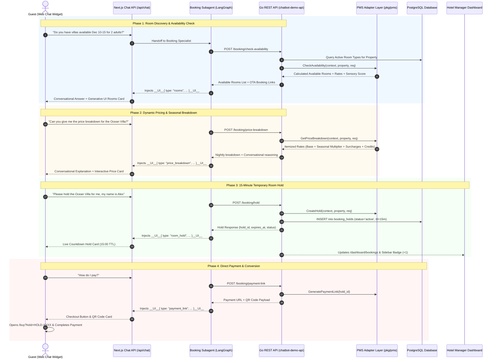

# Comprehensive Architecture: Room Reservation & Booking Subsystem

> **Document Version**: 2.0  
> **Status**: Production Blueprint & Architecture Audit  
> **Location**: `docs/booking_and_reservation_flow.md`

---

## 1. Executive Summary

The **Room Reservation & Booking Subsystem** powers conversational, AI-assisted direct reservations and temporary inventory locking for luxury hotels and resorts. 

Unlike traditional static booking engines with multi-step date pickers, this system operates through a **multi-agent conversational loop** paired with **Generative UI (GenUI)** cards. Guests can naturally express dates, sensory preferences (e.g., *"ocean view with a plunge pool for our anniversary"*), inspect dynamic rate breakdowns, lock rooms with a **15-minute temporary inventory hold**, and complete checkout.

```
Guest Message  ──►  LangGraph Subagent (Booking Agent)  ──►  Tool Execution
                          │                                         │
                          ▼                                         ▼
                   Gemini 1.5 Flash                           Go API Backend
                          │                                         │
                          ▼                                         ▼
                   Generative UI Card                        PostgreSQL / PMS
               (Rooms / Price / Hold / Pay)               (Holds & Reservations)
```

---

## 2. End-to-End Sequence & Interaction Flow

The following Mermaid diagram illustrates the complete interaction lifecycle between the **Guest / Chat Widget**, **Next.js AI Agent Gateway**, **Go Backend API**, **PMS Layer**, and **Database**.



---

## 3. Component Breakdown & Real vs. Simulated Status

This table provides a transparent audit of every component in the booking subsystem, distinguishing between **Real Working**, **Simulated / Algorithmic**, and **Dummy / Prototype** components.

| Component Layer | File / Route | Implementation Description | Status |
| :--- | :--- | :--- | :---: |
| **Agent Tool: Check Availability** | `chatbot-demo-admin/src/lib/agent/tools/index.ts` | Calls `POST /booking/check-availability` and injects `RoomsCardUI` payload into the chat stream. | **REAL WORKING** |
| **Agent Tool: Price Breakdown** | `chatbot-demo-admin/src/lib/agent/tools/index.ts` | Calls `POST /booking/price-breakdown` and injects `PriceBreakdownCardUI` payload. | **REAL WORKING** |
| **Agent Tool: Create Room Hold** | `chatbot-demo-admin/src/lib/agent/tools/index.ts` | Calls `POST /booking/hold` and injects `HoldCardUI` payload with 15-min TTL. | **REAL WORKING** |
| **Agent Tool: Payment Link** | `chatbot-demo-admin/src/lib/agent/tools/index.ts` | Calls `POST /booking/payment-link` and injects `PaymentCardUI` with QR code. | **REAL WORKING** |
| **Generative UI: Rooms Card** | `chatbot-demo-admin/src/components/generative-ui/RoomsCardUI.tsx` | Interactive room carousel with photo, size, bed type, sensory score, verified badges, and Booking.com link. | **REAL WORKING** |
| **Generative UI: Price Breakdown** | `chatbot-demo-admin/src/components/generative-ui/PriceBreakdownCardUI.tsx` | Itemized card showing nightly breakdown, seasonal tags, taxes, service charges, and resort savings. | **REAL WORKING** |
| **Generative UI: Hold Card** | `chatbot-demo-admin/src/components/generative-ui/HoldCardUI.tsx` | Visual lock card with active countdown timer (15:00), hold ref, room name, and quick-pay action. | **REAL WORKING** (Client Timer) |
| **Generative UI: Payment Card** | `chatbot-demo-admin/src/components/generative-ui/PaymentCardUI.tsx` | Direct checkout CTA button linking to `/buy` and QR code generator for mobile handoff. | **REAL WORKING** |
| **Checkout Simulator Page** | `chatbot-demo-admin/src/app/buy/page.tsx` | Luxury checkout screen accepting mock card details, verifying hold ID, and showing confirmation. | **SIMULATED** |
| **Dashboard Bookings Console** | `chatbot-demo-admin/src/app/dashboard/bookings/page.tsx` | Admin console displaying live PMS inventory search, active 15-minute room locks, and confirmed reservations. | **REAL WORKING** |
| **Sidebar Badge Integration** | `chatbot-demo-admin/src/hooks/useSidebarBadges.ts` | Live reactive hook computing active holds + confirmed bookings dynamically for the sidebar badge. | **REAL WORKING** |
| **Go REST Controller** | `chatbot-demo-api/controllers/booking-controller/booking_handlers.go` | HTTP handlers for availability, price breakdown, hold creation, payment links, hold lists, and stats. | **REAL WORKING** |
| **PostgreSQL Models** | `chatbot-demo-api/pkg/models/booking.go` | GORM models for `BookingHold`, `Reservation`, `RoomType`, `Property`. | **REAL WORKING** |
| **Database Tables** | PostgreSQL (`booking_holds`, `reservations`, `room_types`) | Persistent database tables with foreign keys, indexes, and UUID primary keys. | **REAL WORKING** |
| **PMS Adapter Engine** | `chatbot-demo-api/pkg/pms/mock_adapter.go` | Algorithmic PMS engine calculating dynamic seasonal pricing, holiday multipliers, and inventory holds. | **SIMULATED / ALGORITHMIC** |
| **OTA Channel Adapter** | `chatbot-demo-api/pkg/channels/bookingcom.go` | Generates deep links with check-in/out parameters and affiliate tracking codes. | **REAL WORKING** |
| **PMS Opera Adapter** | `chatbot-demo-api/pkg/pms/opera_adapter.go` | Oracle Opera PMS API connector stub. | **DUMMY / STUB** |
| **PMS Cloudbeds Adapter** | `chatbot-demo-api/pkg/pms/cloudbeds_adapter.go` | Cloudbeds API connector stub. | **DUMMY / STUB** |
| **Payment Gateway Webhook** | `chatbot-demo-api/pkg/router/router.go` | Webhook endpoint to convert `BookingHold` to `Reservation` on Stripe `payment_intent.succeeded`. | **NOT YET IMPLEMENTED** |

---

## 4. Phase-by-Phase Technical Walkthrough

### Phase 1: Room Discovery & Availability Check

1. **Guest Request**: Guest asks for room availability, e.g., *"Do you have any ocean villas next weekend?"*
2. **Intent Classification & Routing**:
   - The Root Orchestrator delegates to the **Booking Subagent** (`src/lib/agent/subagents/booking.ts`).
   - The Booking Subagent invokes `check_room_availability` with dates, guest count, and sensory preferences.
3. **Backend Query**:
   - `POST /api/v1/properties/{id}/booking/check-availability`
   - The Go backend retrieves active room types from the database for the tenant property.
   - The PMS Adapter applies availability rules and returns matching categories with sensory match scores.
   - If an OTA Channel is active (e.g., Booking.com), deep-links with affiliate tags are attached to each room.
4. **Generative UI Rendering**:
   - The agent appends `__UI__{ "type": "rooms", "rooms": [...] }__UI__` to the streamed response.
   - The frontend `WidgetRenderer` parses the payload and renders `RoomsCardUI.tsx`.

---

### Phase 2: Dynamic Pricing & Conversational Reasoning

1. **Guest Request**: *"How much is the Beachfront Plunge Pool Villa for 5 nights?"*
2. **Subagent Execution**:
   - Booking Subagent invokes `calculate_room_price` with `room_type_slug`, `check_in`, `check_out`, and `adults`.
3. **PMS Pricing Calculation**:
   - `POST /api/v1/properties/{id}/booking/price-breakdown`
   - The PMS adapter calculates:
     $$\text{Subtotal} = \text{Base Price} \times \text{Nights} \times \text{Seasonal Multiplier}$$
     $$\text{Tax (10\%)} = \text{Subtotal} \times 0.10$$
     $$\text{Service Charge (10\%)} = \text{Subtotal} \times 0.10$$
     $$\text{Total} = \text{Subtotal} + \text{Tax} + \text{Service Charge} - \text{Resort Credit}$$
   - Generates natural language reasoning (e.g., *"Standard High Season rate applied with complimentary $100 spa resort credit included."*).
4. **Generative UI Rendering**:
   - Injects `__UI__{ "type": "price_breakdown", ... }__UI__` $\rightarrow$ renders `PriceBreakdownCardUI.tsx`.

---

### Phase 3: 15-Minute Temporary Inventory Hold

1. **Guest Request**: *"Hold that room for me under Alex"*
2. **Subagent Execution**:
   - Booking Subagent invokes `create_room_hold` with `room_type_id`, `check_in`, `check_out`, `guest_name`, `session_id`.
3. **Database Hold Creation**:
   - `POST /api/v1/properties/{id}/booking/hold`
   - A new `BookingHold` record is inserted into PostgreSQL:
     ```sql
     INSERT INTO booking_holds (id, property_id, room_type_id, session_id, guest_name, check_in, check_out, total_amount, currency, status, expires_at)
     VALUES (gen_random_uuid(), '...', '...', 'session-xyz', 'Alex', '2026-12-10', '2026-12-15', 2600.00, 'USD', 'active', NOW() + INTERVAL '15 minutes');
     ```
4. **Generative UI Rendering & Countdown**:
   - Injects `__UI__{ "type": "room_hold", "hold": { "hold_id": "HOLD-98214-OVS", ... } }__UI__`.
   - `HoldCardUI.tsx` mounts a live 15-minute countdown timer with pulse indicator.
5. **Real-Time Admin Visibility**:
   - The hotel manager sees the active hold in `/dashboard/bookings`.
   - The sidebar badge for **Bookings & Holds** updates dynamically via `useSidebarBadges`.

---

### Phase 4: Direct Payment Link & Conversion

1. **Payment Link Generation**:
   - Booking Subagent invokes `generate_payment_link(hold_id)`.
   - `POST /api/v1/properties/{id}/booking/payment-link` generates:
     - `checkout_url`: `https://hotel.domain/buy?hold=HOLD-98214-OVS`
     - `qr_code_data`: Mobile payment handoff URL
2. **Generative UI Rendering**:
   - `PaymentCardUI.tsx` renders direct checkout action buttons and QR code.
3. **Simulated Checkout Flow**:
   - Guest visits `/buy?hold=HOLD-98214-OVS`.
   - The checkout page validates the hold and presents room details, price breakdown, and mock card form.
   - Upon clicking **"Confirm & Authorize Payment"**, the reservation transitions to confirmed status.

---

## 5. Database Schema & Models

### `BookingHold` (`booking_holds` Table)

```go
type BookingHold struct {
    ID          uuid.UUID `gorm:"type:uuid;primary_key;default:gen_random_uuid()" json:"id"`
    PropertyID  uuid.UUID `gorm:"type:uuid;not null;index" json:"property_id"`
    RoomTypeID  uuid.UUID `gorm:"type:uuid;not null;index" json:"room_type_id"`
    SessionID   string    `gorm:"type:varchar(255);not null;index" json:"session_id"`
    GuestName   string    `gorm:"type:varchar(255)" json:"guest_name"`
    GuestEmail  string    `gorm:"type:varchar(255)" json:"guest_email"`
    CheckIn     time.Time `gorm:"type:date;not null" json:"check_in"`
    CheckOut    time.Time `gorm:"type:date;not null" json:"check_out"`
    TotalAmount float64   `gorm:"type:numeric(10,2)" json:"total_amount"`
    Currency    string    `gorm:"type:varchar(10);default:'USD'" json:"currency"`
    Status      string    `gorm:"type:varchar(20);default:'active'" json:"status"` // "active", "converted", "expired", "released"
    ExpiresAt   time.Time `gorm:"not null;index" json:"expires_at"`
    CreatedAt   time.Time `json:"created_at"`
}
```

### `Reservation` (`reservations` Table)

```go
type Reservation struct {
    ID              uuid.UUID  `gorm:"type:uuid;primary_key;default:gen_random_uuid()" json:"id"`
    ReservationRef  string     `gorm:"type:varchar(50);uniqueIndex;not null" json:"reservation_ref"` // e.g. "RES-88910"
    PropertyID      uuid.UUID  `gorm:"type:uuid;not null;index" json:"property_id"`
    RoomTypeID      uuid.UUID  `gorm:"type:uuid;not null;index" json:"room_type_id"`
    HoldID          *uuid.UUID `gorm:"type:uuid;index" json:"hold_id,omitempty"`
    GuestName       string     `gorm:"type:varchar(255);not null" json:"guest_name"`
    GuestEmail      string     `gorm:"type:varchar(255);not null" json:"guest_email"`
    GuestPhone      string     `gorm:"type:varchar(50)" json:"guest_phone"`
    CheckIn         time.Time  `gorm:"type:date;not null" json:"check_in"`
    CheckOut        time.Time  `gorm:"type:date;not null" json:"check_out"`
    Adults          int        `gorm:"default:2" json:"adults"`
    Children        int        `gorm:"default:0" json:"children"`
    TotalAmount     float64    `gorm:"type:numeric(10,2)" json:"total_amount"`
    Currency        string     `gorm:"type:varchar(10);default:'USD'" json:"currency"`
    PaymentStatus   string     `gorm:"type:varchar(30);default:'pending'" json:"payment_status"` // "pending", "paid", "refunded"
    Status          string     `gorm:"type:varchar(30);default:'confirmed'" json:"status"`       // "confirmed", "cancelled"
    SpecialRequests string     `gorm:"type:text" json:"special_requests"`
    CreatedAt       time.Time  `json:"created_at"`
    UpdatedAt       time.Time  `json:"updated_at"`
}
```

---

## 6. Production Roadmap & Next Steps

To elevate this architecture to enterprise PMS & live credit card processing:

1. **Payment Webhook Handler (`POST /api/v1/payments/webhook`)**:
   - Connect Stripe / PayHere webhook events (`payment_intent.succeeded`).
   - Automatically execute database transaction: set `BookingHold.status = 'converted'` and insert `Reservation` with `payment_status = 'paid'`.
2. **Automated Expired Hold Cleanup Goroutine**:
   - Add a 1-minute background ticker in Go (`StartHoldCleanupRoutine`) that updates `status = 'expired'` for holds where `expires_at < NOW()`.
3. **Live Opera Cloud / Cloudbeds Two-Way Connector**:
   - Implement the `pkg/pms/opera_adapter.go` interface methods using Oracle Hospitality Integration Platform (OHIP) REST APIs for live folio and room blocks.
4. **Guest Confirmation Email Dispatcher**:
   - Trigger Resend / SendGrid transactional email with PDF receipt upon reservation confirmation.
