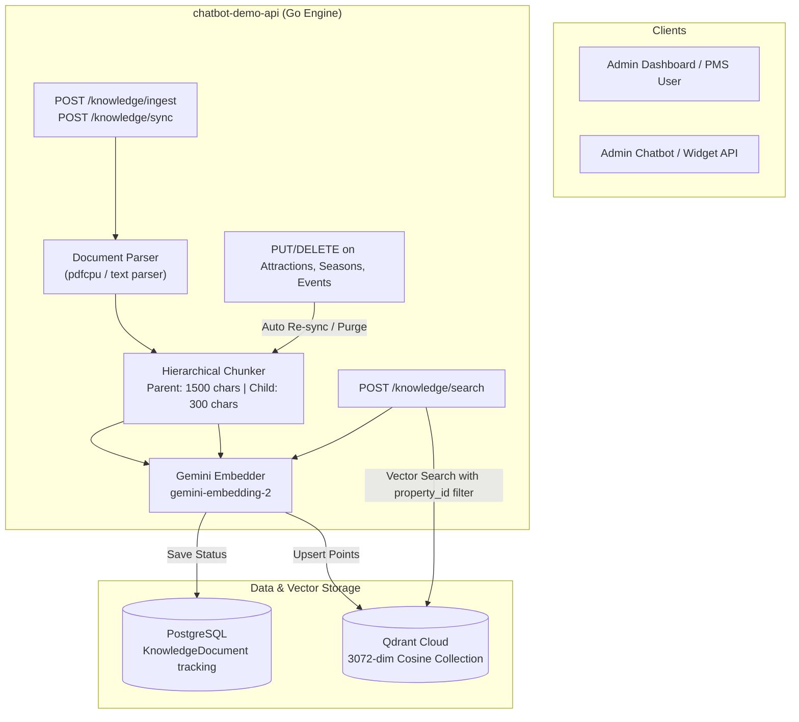
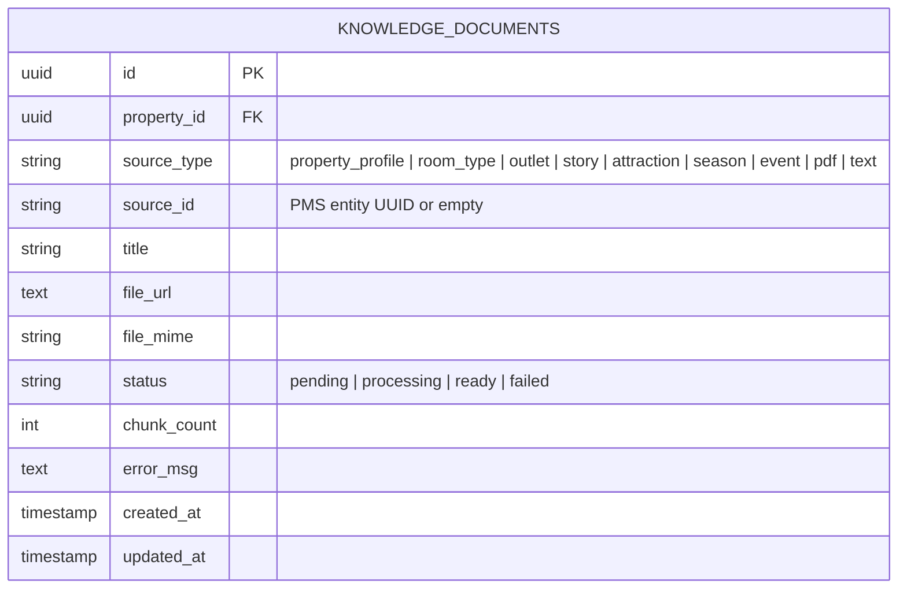

# Knowledge Engine (RAG Pipeline) API Documentation

The **Knowledge Engine Module** provides multi-tenant Retrieval-Augmented Generation (RAG) ingestion, document parsing, hierarchical chunking, vector embedding generation, and vector retrieval capabilities for the AI Hospitality Experience Platform.

It converts unstructured property documents (PDFs, Markdown, plain text) and structured PMS entities (Rooms, Outlets, Stories, Attractions, Seasons, Events) into **3072-dimensional vector embeddings** using Google's multimodal `gemini-embedding-2` model and stores them in **Qdrant Cloud** with strict multi-tenant property filtering.

---

## 1. System Architecture & RAG Pipeline Flow

### Ingestion & Search Flow



---

## 2. Chunking & Embedding Strategy

### Hierarchical Chunking
To balance vector retrieval precision with LLM contextual awareness, text is processed through a two-tier hierarchical chunker:
- **Child Chunks (~300 chars, 50-char overlap)**: The precise granular unit embedded and searched in vector space.
- **Parent Content (~1500 chars)**: The broader surrounding section attached to each child payload. During retrieval, the full `parent_content` is passed to the LLM prompt to prevent fragmented context.

### Model Specification: `gemini-embedding-2`
- **Vector Dimensions**: `3072`
- **Distance Metric**: `Cosine`
- **Prompt Task Prefixing**:
  - **Ingestion Format**: `title: {source_title} | text: {chunk_content}`
  - **Query Format**: `task: question answering | query: {search_query}`

---

## 3. Data Schemas

### PostgreSQL Tracking Table (`knowledge_documents`)



### Qdrant Vector Payload (`hotel-chatbot` Collection)

| Key | Type | Description | Index |
|---|---|---|---|
| `document_id` | String (UUID) | ID of the source `KnowledgeDocument` | Keyword Index |
| `property_id` | String (UUID) | ID of the owning property (Multi-tenant filter) | Keyword Index |
| `content` | String | Child chunk text (~300 chars) | None |
| `parent_content` | String | Surrounding parent section text (~1500 chars) | None |
| `source_type` | String | Entity category (e.g. `room_type`, `outlet`, `text`) | None |
| `source_title` | String | Human-readable document or entity title | None |
| `chunk_index` | Integer | Sequence index within document | None |

---

## 4. API Conventions & Response Envelopes

### Base URL
```
http://localhost:8080/api/v1/properties/{property_id}/knowledge
```

### Response Envelopes

#### Synchronous Success (HTTP 200 OK)
```json
{
  "status": "success",
  "message": "Operation completed successfully",
  "data": { ... }
}
```

#### Asynchronous Accepted (HTTP 202 Accepted)
```json
{
  "status": "accepted",
  "message": "Ingestion started in background",
  "data": {
    "document_id": "2e5015b5-99ef-4526-8c20-3831476fd780"
  }
}
```

#### Error Response (HTTP 400 / 404 / 500)
```json
{
  "status": "error",
  "message": "Detailed error message description"
}
```

---

## 5. API Endpoint Specifications

---

> **Authentication**: Every endpoint in this document requires a staff JWT scoped to the
> property (`{id}` must match the caller's `property_id` claim, or the caller must be
> `super_admin`) — the knowledge base is a dashboard-only management surface, never called
> directly by a guest.

### 1. Ingest Knowledge Document
Uploads a document (PDF, TXT, Markdown) or raw text for asynchronous parsing, chunking, embedding, and vector storage.

* **HTTP Method**: `POST`
* **Path**: `/api/v1/properties/{id}/knowledge/ingest`
* **Supported Content-Types**:
  1. `application/json` (Raw text string)
  2. `multipart/form-data` (File upload)

#### Option A: JSON Body (Raw Text)
**Request Header**: `Content-Type: application/json`  
**Request Payload**:
```json
{
  "title": "Spa & Wellness Services Guide",
  "text": "The Anantara Spa at Grand Ocean Resort offers holistic Ayurvedic treatments, deep tissue massages, and oceanfront yoga sessions. Operating hours are 08:00 AM to 09:00 PM daily. Reservations are required at least 2 hours in advance."
}
```

#### Option B: Multipart Form (File Upload)
**Request Header**: `Content-Type: multipart/form-data`  
**Form Fields**:
- `file` *(required)*: Document binary (`.pdf`, `.txt`, `.md`). Max 32MB.
- `title` *(optional)*: Custom title. Defaults to filename if omitted.

**cURL Example (JSON)**:
```bash
curl -X POST http://localhost:8080/api/v1/properties/a8360f9a-445f-405a-9725-232113f382b4/knowledge/ingest \
  -H "Content-Type: application/json" \
  -d '{
    "title": "Spa Services Guide",
    "text": "The Anantara Spa offers Ayurvedic treatments and yoga daily from 08:00 AM to 09:00 PM."
  }'
```

**cURL Example (File Upload)**:
```bash
curl -X POST http://localhost:8080/api/v1/properties/a8360f9a-445f-405a-9725-232113f382b4/knowledge/ingest \
  -F "file=@/path/to/hotel_brochure.pdf" \
  -F "title=Hotel Experience Brochure"
```

**Response Payload (HTTP 202 Accepted)**:
```json
{
  "status": "accepted",
  "message": "Text ingestion started",
  "data": {
    "document_id": "2e5015b5-99ef-4526-8c20-3831476fd780"
  }
}
```

---

### 2. Auto-Sync PMS Property Knowledge
Reads all structured PMS entities for the property (Property Profile, Room Types, Dining Outlets, Stories, Attractions, Seasons, Events), builds canonical text blocks, embeds them, and upserts them into Qdrant Cloud.

* **HTTP Method**: `POST`
* **Path**: `/api/v1/properties/{id}/knowledge/sync`
* **Request Header**: None
* **Request Payload**: None

**cURL Example**:
```bash
curl -X POST http://localhost:8080/api/v1/properties/a8360f9a-445f-405a-9725-232113f382b4/knowledge/sync
```

**Response Payload (HTTP 200 OK)**:
```json
{
  "status": "success",
  "message": "Property knowledge sync completed",
  "data": {
    "synced_documents": 4
  }
}
```

---

### 3. List Ingested Documents
Retrieves all knowledge document records and their current ingestion status for a given property.

* **HTTP Method**: `GET`
* **Path**: `/api/v1/properties/{id}/knowledge/documents`

**cURL Example**:
```bash
curl -X GET http://localhost:8080/api/v1/properties/a8360f9a-445f-405a-9725-232113f382b4/knowledge/documents
```

**Response Payload (HTTP 200 OK)**:
```json
{
  "status": "success",
  "message": "Documents retrieved",
  "data": [
    {
      "id": "2e5015b5-99ef-4526-8c20-3831476fd780",
      "property_id": "a8360f9a-445f-405a-9725-232113f382b4",
      "source_type": "text",
      "title": "Spa Services Guide",
      "status": "ready",
      "chunk_count": 2,
      "created_at": "2026-07-30T20:01:54.152712+05:30",
      "updated_at": "2026-07-30T20:01:58.629463+05:30"
    },
    {
      "id": "42858b45-96ec-4ab6-a58a-0b38dc798973",
      "property_id": "a8360f9a-445f-405a-9725-232113f382b4",
      "source_type": "outlet",
      "source_id": "39b69bac-94bc-4950-9ff5-0b020aad8dcf",
      "title": "Grand Ocean Resort & Spa — Serendib Ocean Grill",
      "status": "ready",
      "chunk_count": 2,
      "created_at": "2026-07-30T20:01:24.226401+05:30",
      "updated_at": "2026-07-30T20:01:26.784463+05:30"
    }
  ]
}
```

---

### 4. Delete Knowledge Document
Deletes a document tracking record from PostgreSQL and purges all associated vector points from Qdrant Cloud.

* **HTTP Method**: `DELETE`
* **Path**: `/api/v1/properties/{id}/knowledge/documents/{docId}`

**cURL Example**:
```bash
curl -X DELETE http://localhost:8080/api/v1/properties/a8360f9a-445f-405a-9725-232113f382b4/knowledge/documents/2e5015b5-99ef-4526-8c20-3831476fd780
```

**Response Payload (HTTP 200 OK)**:
```json
{
  "status": "success",
  "message": "Document deleted successfully"
}
```

---

### 5. Semantic Vector Search (RAG Debug Endpoint)
Generates an embedding vector for a search query and retrieves top-K vector matches scoped strictly to the specified `property_id`.

* **HTTP Method**: `POST`
* **Path**: `/api/v1/properties/{id}/knowledge/search`
* **Request Header**: `Content-Type: application/json`
* **Request Payload**:
```json
{
  "query": "Tell me about the ocean view suite bed and size",
  "top_k": 3
}
```

**cURL Example**:
```bash
curl -X POST http://localhost:8080/api/v1/properties/a8360f9a-445f-405a-9725-232113f382b4/knowledge/search \
  -H "Content-Type: application/json" \
  -d '{
    "query": "Tell me about the ocean view suite bed and size",
    "top_k": 3
  }'
```

**Response Payload (HTTP 200 OK)**:
```json
{
  "status": "success",
  "message": "Search completed",
  "data": {
    "query": "Tell me about the ocean view suite bed and size",
    "results": [
      {
        "score": 0.7519874,
        "content": "[Room: Ocean View Suite | Grand Ocean Resort & Spa]\nCode: OVS-01 | Size: 76 sqm | Bed: King Bed | View: Ocean View\nMax Adults: 2 | Max Children: 1 | Active: true\nBase Price: 450.00 USD\nDescription: Spacious suite featuring floor-to-ceiling ocean views and a private balcony.",
        "parent_content": "[Room: Ocean View Suite | Grand Ocean Resort & Spa]\nCode: OVS-01 | Size: 76 sqm | Bed: King Bed | View: Ocean View\nMax Adults: 2 | Max Children: 1 | Active: true\nBase Price: 450.00 USD\nDescription: Spacious suite featuring floor-to-ceiling ocean views and a private balcony.\nSensory Experience: Around sunrise you will usually hear the ocean waves before you see them. Guests often mention opening balcony doors while enjoying coffee as fishing boats head out across calm morning waters.",
        "source_type": "room_type",
        "source_title": "Grand Ocean Resort & Spa — Ocean View Suite",
        "chunk_index": 0
      }
    ]
  }
}
```

---

## 6. Automated Real-Time Knowledge Base Synchronization

Whenever destination attractions, seasonal intelligence guides, or property events are updated (`PUT`) or removed (`DELETE`), the system automatically triggers synchronous knowledge base synchronization. Rooms and stories do **not** have this behavior — there is no auto-sync
on room or story mutations, and stories have no `PUT`/update endpoint at all (see
`property_management_api.md` §B/§E). Media assets have a related but separate mechanism: `POST
/api/v1/properties/{id}/media/sync` runs Gemini Vision analysis over media and indexes the
resulting descriptions — it is not triggered automatically on every media mutation and does
not use the canonical-text-block re-embed described below.

1. **On Entity Update (`PUT`)**:
   - The Go engine formats a refreshed canonical string block containing all updated fields.
   - The string is split into hierarchical parent/child chunks.
   - `gemini-embedding-2` generates new 3072-dimensional vector embeddings.
   - Vectors are upserted into Qdrant Cloud under the existing `source_id` record.
2. **On Entity Deletion (`DELETE`)**:
   - The system locates the associated `KnowledgeDocument` entry in PostgreSQL by `source_id`.
   - All associated vector points are deleted from Qdrant Cloud.
   - The `KnowledgeDocument` record is purged from PostgreSQL.
