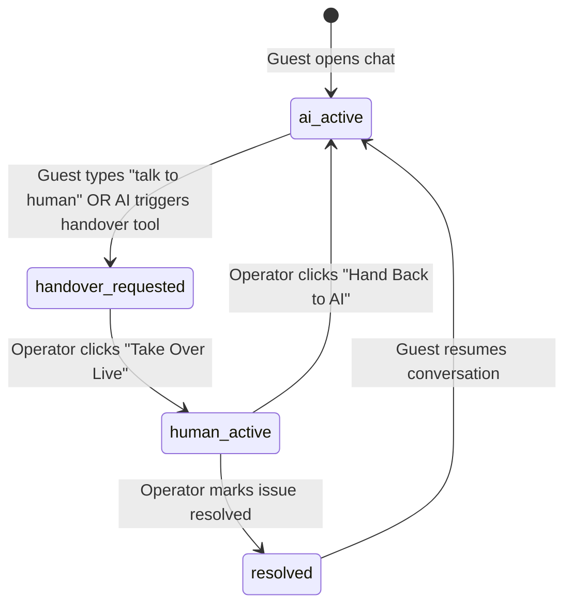

# Live Chat, Human Handover & Real-Time WebSocket API Specification

The **Live Chat & Human Handover Subsystem** provides sub-50ms bidirectional communication between hotel guests (via the Web Widget) and front-desk concierge operators (via the Live Concierge Desk in the Admin Dashboard). 

It orchestrates seamless transitions between the **Autonomous AI Concierge** and **Human Staff**, with zero-downtime reconnects, multi-session operator triage, staff whisper notes, and AI copilot reply suggestions.

---

## 🏗️ Architecture & Component Topology

```mermaid
flowchart TD
    subgraph GuestLayer [Guest Client Layer]
        Widget[Web Chat Widget / Simulator]
    end

    subgraph AdminLayer [Staff & Concierge Layer]
        Dashboard[Unified Conversations Dashboard]
        GlobalListener[Global Session Multi-Queue Listener]
    end

    subgraph BackendLayer [Go WebSocket Hub (chatbot-demo-api)]
        Hub[Gorilla WebSocket Hub Engine]
        Rooms[In-Memory Session Rooms map[sessionKey]map[*Client]bool]
        GlobalRoom[Global Operator Channel]
    end

    subgraph DataLayer [Storage & Persistence]
        Postgres[(PostgreSQL: chat_sessions & chat_messages)]
        LangGraph[LangGraph Multi-Agent Orchestrator]
    end

    Widget <-->|WS: /api/v1/ws/sessions/{key}| Hub
    Dashboard <-->|WS: /api/v1/ws/sessions/{key}| Hub
    GlobalListener <-->|WS: /api/v1/ws/sessions/global?role=operator| Hub

    Hub --- Rooms
    Hub --- GlobalRoom

    Hub -->|Async Non-Blocking Writes| Postgres
    Widget -.->|POST /api/chat when AI Active| LangGraph
    LangGraph -.->|POST /chat-sessions/{key}/messages| Postgres
```

---

## 📡 1. WebSocket Protocol Specification

### Endpoints
| Protocol | Path | Role | Description |
| :--- | :--- | :--- | :--- |
| `WS` | `/api/v1/ws/sessions/{sessionKey}` | `guest` / `operator` | Peer-to-peer room for active guest and operator communication. |
| `WS` | `/api/v1/ws/sessions/global?role=operator` | `operator` | Global stream delivering state changes, new messages, and handover alerts across **all active sessions** in the property. |

### Query Parameters
* `role`: `"guest"` | `"operator"` (Default: `"guest"`)
* `name`: Display name of the participant (e.g., `"Shakthi (Front Desk)"` or `"Guest"`).
* `propertyId`: UUID of the active property for multi-tenant boundary isolation.

---

## 💬 2. JSON Frame Format & Event Types

Every payload exchanged over the WebSocket connection adheres to the standard `WSMessage` schema:

```json
{
  "type": "chat_message",
  "session_key": "session-a8360f9a-1724678400000",
  "sender": "operator",
  "sender_name": "Dilshan (Concierge)",
  "content": "Good afternoon! I have arranged complimentary late checkout at 2:00 PM for you.",
  "is_whisper": false,
  "is_typing": false,
  "state": "human_active",
  "payload_type": "text",
  "payload_json": "",
  "timestamp": "2026-08-26T14:30:00Z"
}
```

### Event Type Matrix

| Type | Direction | Description |
| :--- | :--- | :--- |
| `chat_message` | Bidirectional | Standard user/operator message turn. Delivered to room peers and persisted to PostgreSQL. |
| `typing` | Bidirectional | Ephemeral typing indicator. Broadcast with zero DB overhead; auto-cleared by peer timeout. |
| `presence` | Server $\rightarrow$ Client | Emitted when a participant connects or disconnects from the session. |
| `state_change` | Bidirectional | Triggers mode change (`ai_active`, `handover_requested`, `human_active`, `resolved`). |
| `session_deleted` | Server $\rightarrow$ Client | Broadcast when an operator permanently purges a conversation. Removes card from all active dashboards. |
| `suggested_replies`| Server $\rightarrow$ Operator | Transmits AI Copilot suggested response drafts tailored to the conversation context. |

---

## 🔄 3. Human Handover Lifecycle State Machine



### Mode Descriptions
1. **`ai_active`**: The LangGraph multi-agent hierarchy (Concierge, Reservations, Dining/Spa, Itinerary) handles guest queries autonomously via streaming SSE.
2. **`handover_requested`**: The guest requested human assistance or the AI guardrails escalated the conversation. The dashboard sounds a luxury audio chime and flags the session in the **Needs Action** triage tab.
3. **`human_active`**: A staff operator has accepted the session. The AI agent pauses inference on that thread, and all messages route directly between guest and human operator via WebSocket.
4. **`resolved`**: Live assistance concluded. The conversation is archived and memory extraction updates the guest profile.

---

## 🔒 4. Staff Internal Whispers (Private Notes)

Operators can leave internal notes during live sessions (e.g. *"Guest requested room upgrade on anniversary"*):
* In `WSMessage`, set `"is_whisper": true` with `"sender": "operator"`.
* **Security Filter**: The Go Hub automatically skips sending whisper payloads to any client connected with `role != "operator"`.
* Whispers are highlighted with an amber border and lock icon in the staff console and are completely invisible to the guest.

---

## 🛠️ 5. REST Control Endpoints

### 1. List Active Chat Sessions
* **Endpoint**: `GET /api/v1/properties/{id}/chat-sessions`
* **Query Params**: `session_mode` (`All`, `handover_requested`, `human_active`, `ai_active`), `channel` (`web_chat`, `whatsapp`)
* **Response**:
```json
[
  {
    "id": "e391b10a-3c5e-49b8-a764-cf36f251c142",
    "property_id": "a8360f9a-445f-405a-9725-232113f382b4",
    "session_key": "session-a8360f9a-1724678400000",
    "guest_name": "Elena Rostova",
    "room_number": "Villa 402",
    "channel": "web_chat",
    "session_mode": "handover_requested",
    "assigned_operator": "",
    "last_message_at": "2026-08-26T14:28:10Z",
    "created_at": "2026-08-26T14:15:00Z"
  }
]
```

---

### 2. Request Human Handover (Guest/AI Trigger)
* **Endpoint**: `POST /api/v1/properties/{id}/chat-sessions/{sessionKey}/request-handover`
* **Request Body**:
```json
{
  "reason": "Guest asked for manager regarding villa check-in time",
  "guest_name": "Elena Rostova",
  "room_number": "Villa 402"
}
```
* **Effects**:
  - Updates `session_mode` in database to `handover_requested`.
  - Broadcasts `state_change` across the session room and the `global` operator stream.
  - Generates an audible chime on all open concierge dashboards.

---

### 3. Takeover Session (Operator Action)
* **Endpoint**: `POST /api/v1/properties/{id}/chat-sessions/{sessionKey}/takeover`
* **Request Body**:
```json
{
  "operator_name": "Dilshan (Duty Manager)"
}
```
* **Effects**:
  - Sets `session_mode` to `human_active` and `assigned_operator` to the staff member's name.
  - Broadcasts `state_change` to the guest widget, changing widget banner to *"Connected with Dilshan (Duty Manager)"*.

---

### 4. Hand Back to AI (Operator Action)
* **Endpoint**: `POST /api/v1/properties/{id}/chat-sessions/{sessionKey}/handback`
* **Effects**:
  - Sets `session_mode` to `ai_active`.
  - Sends system transition message to guest widget: *"Operator has concluded live assistance. AI Concierge is now active."*

---

### 5. Fetch Suggested AI Copilot Replies
* **Endpoint**: `GET /api/v1/properties/{id}/chat-sessions/{sessionKey}/suggested-replies`
* **Response**:
```json
{
  "suggestions": [
    "I would be delighted to arrange complimentary late checkout at 2:00 PM for you.",
    "Let me check with our housekeeping team right away and confirm your request.",
    "Our private dining team is preparing your table now. Is there anything else you require?"
  ]
}
```

---

### 6. Delete Chat Session (Permanent Purge)
* **Endpoint**: `DELETE /api/v1/properties/{id}/chat-sessions/{sessionKey}`
* **Effects**:
  - Deletes all associated records in `chat_messages` and `chat_sessions`.
  - Broadcasts `session_deleted` event so all open dashboards remove the conversation from view instantly.
