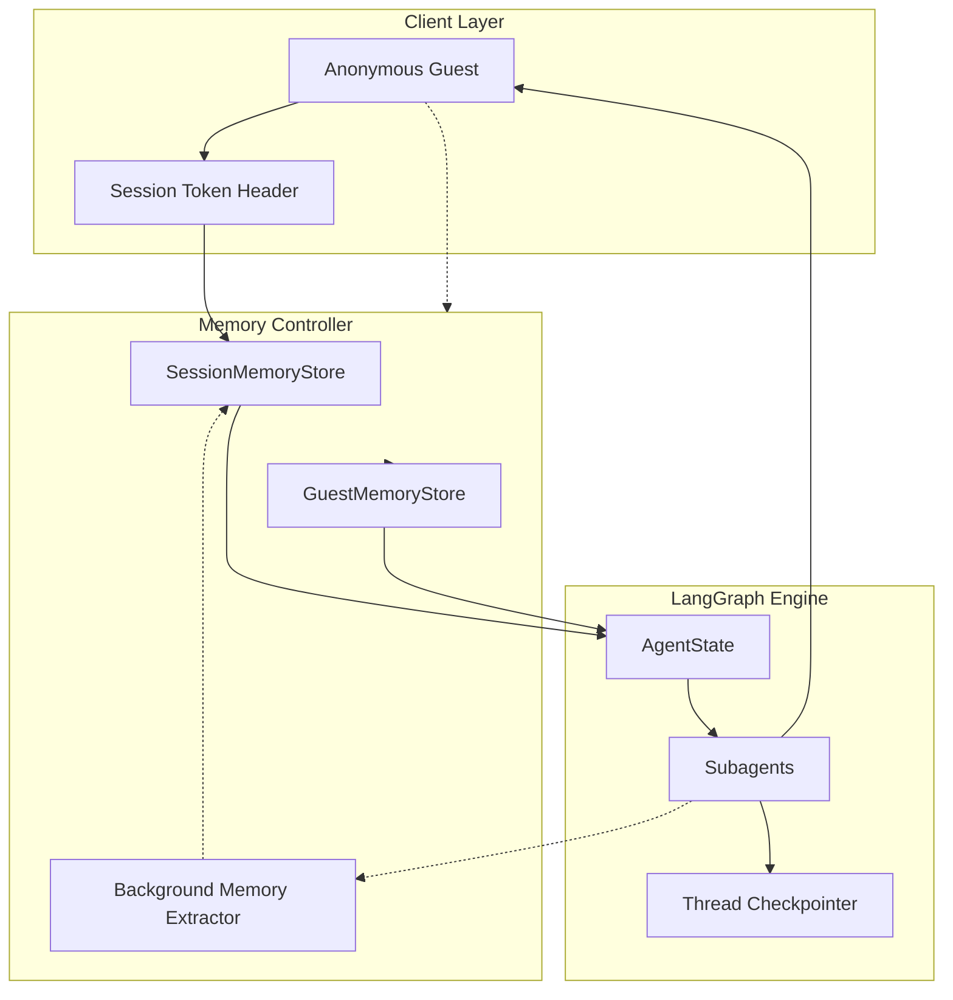
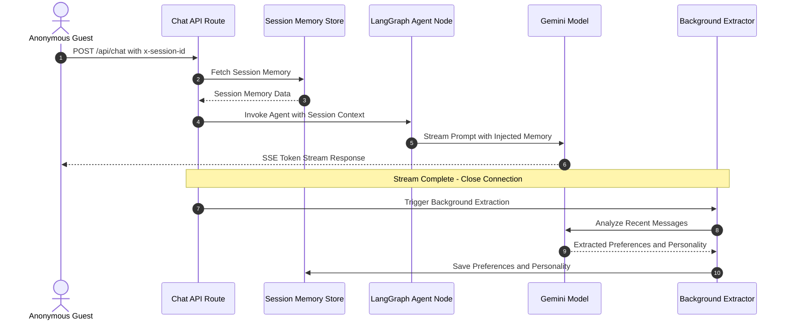

# Memory Controller & Session Architecture

The **Memory Controller** provides a high-performance, dual-tier memory system designed for the AI Hospitality Experience Platform. It manages short-term conversational context, real-time guest preferences, travel intent summaries, and long-term historical guest profiles.

---

## 1. Architectural Overview & System Flow



---

## 2. Zero-Latency Execution Sequence (Chat Turn vs Async Memory Extraction)

To ensure the fastest possible conversational response times for guests:
1. **Zero-Latency Prompt Enrichment**: When a chat request arrives, session memory is retrieved synchronously from an in-memory map in **under 1 millisecond** and immediately injected into the agent prompt.
2. **Asynchronous Background Extraction**: The LLM analyzes the conversation, extracts new preferences, and updates the traveler personality summary **after** the SSE streaming response has finished. Response delivery is never delayed by memory synthesis.



---

## 3. Memory Tiers

### Short-Term Memory (Session Scope)
- **Scope**: Scoped to the current thread or chat session.
- **Identifier**: `sessionId` (anonymous UUID generated on the client side, saved in `localStorage.getItem('holaa_active_session_${propertyId}')`, and passed in the `x-session-id` request header).
- **Contents**:
  - `preferences`: Extracted guest choices (dietaryTags, preferredView, bedType, travelPartySize, travelDates, budgetRange, activityInterests, specialRequests).
  - `personalitySummary`: Dynamic 1-2 sentence LLM-synthesized traveler persona and travel intent.

### Long-Term Memory (Guest Scope)
- **Scope**: Cross-session persistence across browser visits and chat sessions.
- **Identifier**: `guestId` (stored in `localStorage.getItem('holaa_guest_id')`, passed in `x-guest-id` request header).
- **Contents**: Historical guest profile, lifetime accumulated preferences, past stays, and permanent dietary/accessibility needs.
- **Client Storage & Auto-Hydration Lifecycle**:
  1. On page load, `ChatSimulator` reads `holaa_guest_id` and `holaa_active_session_${propertyId}` from `localStorage`.
  2. If an active session exists, it calls `GET /api/v1/properties/{id}/chat-sessions/{sessionKey}/messages` to restore the conversation history seamlessly.
  3. When the guest clicks "New Chat", a fresh `sessionKey` is generated in `localStorage`, resetting the dialogue while preserving the guest's long-term memory.
- **Anonymous Session Binding**: When an unauthenticated session guest discloses their identity (email, phone, name), the short-term preferences and intent automatically merge into their permanent `GuestProfile`.
- > **Correction, verified during the WhatsApp integration build (see `whatsapp_integration_api.md`)**:
  > the mechanism described above (`bindGuestIdToSession` / `POST /api/memory/bind`, §4.4 below)
  > has **zero callers anywhere in the actual guest-facing frontend** — no component, no tool,
  > fetches that route. Every `models.GuestProfile{}` construction in the Go backend was grepped
  > directly; the only one is inside `BindSessionToGuest` (§5.3), reachable only through the dead
  > route above. In practice, `GuestProfile` has had no live writer at all on the web side —
  > this section describes designed, still-correct behavior that has simply never fired in
  > production. The WhatsApp integration's `FindOrCreateGuestByPhone` (§5.5 below) is the first
  > real writer this table has ever had.

---

## 4. API Endpoints

> **Architecture note**: the four endpoints below are **Next.js server routes**
> (`chatbot-demo-admin`, default `http://localhost:3000`) — not the Go backend. This is the
> one place in the platform's API surface with a flat, unversioned path instead of the
> `/api/v1/properties/{id}/...` convention every other document in this set uses, and it's
> easy to assume the same `localhost:8080` base URL as everywhere else, which would be wrong.
> They implement the in-process, sub-millisecond cache layer described in §2 above, and
> write through to the Go backend's own persistent memory endpoints (§4.5 below) so state
> survives a serverless cold start. All four are unauthenticated by design — guests are never
> logged in.

### 1. Get Session Short-Term Memory
Retrieve current preferences, intent summary, and subagent state for a given session.

* **HTTP Method**: `GET`
* **Path**: `/api/memory/session`
* **Headers**:
  - `x-session-id`: `UUID` (Session identifier)
* **Response Payload (HTTP 200 OK)**:
```json
{
  "status": "success",
  "data": {
    "sessionId": "session-12345",
    "propertyId": "a8360f9a-445f-405a-9725-232113f382b4",
    "preferences": {
      "dietaryTags": ["Vegan"],
      "preferredView": "Ocean View",
      "travelPartySize": 2,
      "activityInterests": ["Spa", "Whale watching"]
    },
    "personalitySummary": "Honeymoon couple looking for a luxurious oceanfront experience with spa wellness and vegan dining options.",
    "createdAt": 1722800000000,
    "updatedAt": 1722800120000
  }
}
```

### 2. Update Session Short-Term Memory
Manually seed or override session preferences or personality summary.

* **HTTP Method**: `POST`
* **Path**: `/api/memory/session`
* **Headers**:
  - `x-session-id`: `UUID`
* **Request Body**:
```json
{
  "preferences": {
    "dietaryTags": ["Halal"],
    "travelPartySize": 4
  },
  "personalitySummary": "Family traveler seeking child-friendly activities and spacious accommodations."
}
```

### 3. Clear Session Short-Term Memory
Purges the in-memory short-term memory block for the active session.

* **HTTP Method**: `DELETE`
* **Path**: `/api/memory/session`
* **Headers**:
  - `x-session-id`: `UUID`

### 4. Bind Anonymous Session to Guest Profile
Promotes an anonymous session memory block to a permanent guest profile when identity is established.

* **HTTP Method**: `POST`
* **Path**: `/api/memory/bind`
* **Headers**:
  - `x-session-id`: `UUID`
* **Request Body**:
```json
{
  "guestId": "guest-9988",
  "name": "Jane Doe",
  "email": "jane.doe@example.com",
  "phone": "+94 77 123 4567"
}
```
* **Response Payload (HTTP 200 OK)**:
```json
{
  "status": "success",
  "message": "Anonymous session successfully bound to guest profile",
  "data": {
    "session": {
      "sessionId": "session-12345",
      "guestId": "guest-9988",
      "preferences": { ... }
    },
    "guestProfile": {
      "guestId": "guest-9988",
      "name": "Jane Doe",
      "email": "jane.doe@example.com",
      "dietaryTags": ["Vegan"],
      "pastSessionIds": ["session-12345"]
    }
  }
}
```

---

## 5. Go Backend: Persistent Memory Endpoints

These are the actual Go backend routes (`http://localhost:8080`, standard
`/api/v1/properties/{id}/...` convention) that the Next.js routes in §4 write through to and
read from. All are **public** — the guest chat backend calls them server-to-server on behalf
of an unauthenticated guest.

### 5.1 Get Session Memory
* **HTTP Method**: `GET`
* **Path**: `/api/v1/properties/{id}/memory/session/{sessionId}`
* If no record exists yet, returns a default empty session memory block (HTTP 200) rather
  than a 404, so a first-time guest gets a seamless initialization.

### 5.2 Upsert Session Memory
* **HTTP Method**: `POST`
* **Path**: `/api/v1/properties/{id}/memory/session`
* **Request Body**: `{ "session_id": "...", "preferences": "<JSON string>", "personality_summary": "...", "last_subagent": "..." }`

### 5.3 Bind Session to Guest Profile
* **HTTP Method**: `POST`
* **Path**: `/api/v1/properties/{id}/memory/bind`
* **Request Body**: `{ "session_id": "...", "guest_id": "<optional>", "email": "<optional>", "name": "...", "phone": "..." }`
  — identify the guest by `guest_id` (scoped to this property — a guest ID from another
  property will not match) or by `email`; a new `GuestProfile` is created if neither matches
  an existing record.

### 5.4 Get Guest Profile
Retrieves a long-term guest profile directly by ID — used by the guest chat backend to
rehydrate historical preferences (dietary tags, preferred view, past special requests) mid-conversation.

* **HTTP Method**: `GET`
* **Path**: `/api/v1/properties/{id}/guests/{guestId}`
* **Response (`200 OK`)**:
```json
{
  "status": "success",
  "message": "Guest profile retrieved successfully",
  "data": {
    "id": "guest-9988",
    "property_id": "a8360f9a-445f-405a-9725-232113f382b4",
    "name": "Jane Doe",
    "email": "jane.doe@example.com",
    "phone": "+94 77 123 4567",
    "dietary_tags": "[\"Vegan\"]",
    "preferred_view": "Ocean View",
    "travel_party_size": 2,
    "special_requests": "[]",
    "last_visited_property_id": "a8360f9a-445f-405a-9725-232113f382b4",
    "created_at": "2026-08-01T12:00:00Z",
    "updated_at": "2026-08-10T07:45:00Z"
  }
}
```

### 5.5 Find or Create Guest by Phone (internal function, not an HTTP route)
Unlike §5.1–5.4, this is a plain Go function
(`FindOrCreateGuestByPhone(db, propertyID, phone)` in
`controllers/memory-controller/memory_handler.go`) called directly from the WhatsApp inbound
webhook receiver — see `whatsapp_integration_api.md` §2.1 for the full picture. It's the actual,
live writer to `GuestProfile` that §3's correction above is about: every WhatsApp guest's first
message creates a real row here, keyed by `(property_id, phone)` and guarded by a partial
unique index on that pair to stay race-safe under at-least-once webhook delivery. Property-scoped,
same as everything else in this table — the same phone number at two different properties
resolves to two separate rows, never merged.
