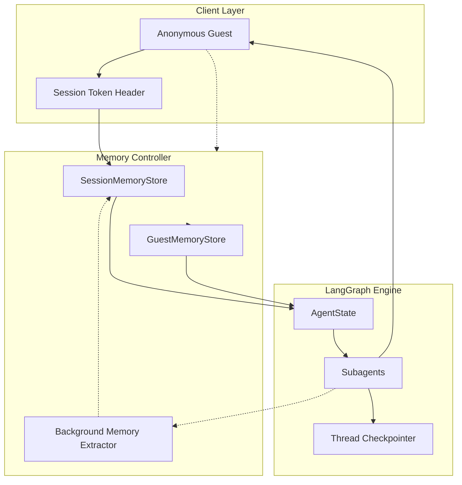
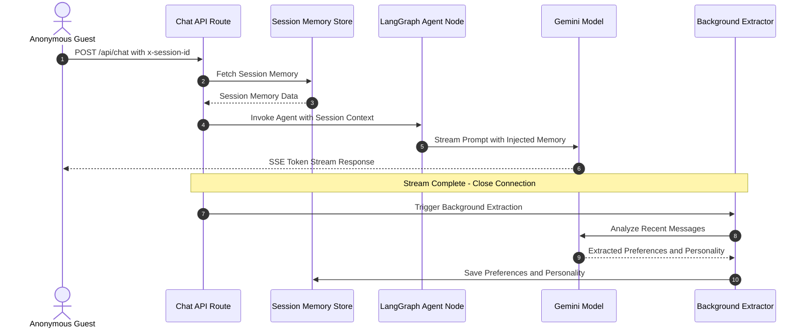

# Memory Controller & Session Architecture

The **Memory Controller** provides a high-performance, dual-tier memory system designed for the AI Hospitality Experience Platform. It manages short-term conversational context, real-time guest preferences, travel intent summaries, and long-term historical guest profiles.

---

## 1. Architectural Overview & System Flow



---

## 2. Zero-Latency Execution Sequence (Chat Turn vs Async Memory Extraction)

To ensure the fastest possible conversational response times for guests:
1. **Zero-Latency Prompt Enrichment**: When a chat request arrives, session memory is retrieved synchronously from an in-memory map in **under 1 millisecond** and immediately injected into the agent prompt.
2. **Asynchronous Background Extraction**: The LLM analyzes the conversation, extracts new preferences, and updates the traveler personality summary **after** the SSE streaming response has finished. Response delivery is never delayed by memory synthesis.



---

## 3. Memory Tiers

### Short-Term Memory (Session Scope)
- **Scope**: Scoped to the current thread or chat session.
- **Identifier**: `sessionId` (anonymous UUID generated on the client side, saved in `localStorage.getItem('aura_active_session_${propertyId}')`, and passed in the `x-session-id` request header).
- **Contents**:
  - `preferences`: Extracted guest choices (dietaryTags, preferredView, bedType, travelPartySize, travelDates, budgetRange, activityInterests, specialRequests).
  - `personalitySummary`: Dynamic 1-2 sentence LLM-synthesized traveler persona and travel intent.

### Long-Term Memory (Guest Scope)
- **Scope**: Cross-session persistence across browser visits and chat sessions.
- **Identifier**: `guestId` (stored in `localStorage.getItem('aura_guest_id')`, passed in `x-guest-id` request header).
- **Contents**: Historical guest profile, lifetime accumulated preferences, past stays, and permanent dietary/accessibility needs.
- **Client Storage & Auto-Hydration Lifecycle**:
  1. On page load, `ChatSimulator` reads `aura_guest_id` and `aura_active_session_${propertyId}` from `localStorage`.
  2. If an active session exists, it calls `GET /api/v1/properties/{id}/chat-sessions/{sessionKey}/messages` to restore the conversation history seamlessly.
  3. When the guest clicks "New Chat", a fresh `sessionKey` is generated in `localStorage`, resetting the dialogue while preserving the guest's long-term memory.
- **Anonymous Session Binding**: When an unauthenticated session guest discloses their identity (email, phone, name), the short-term preferences and intent automatically merge into their permanent `GuestProfile`.

---

## 4. API Endpoints

### 1. Get Session Short-Term Memory
Retrieve current preferences, intent summary, and subagent state for a given session.

* **HTTP Method**: `GET`
* **Path**: `/api/memory/session`
* **Headers**:
  - `x-session-id`: `UUID` (Session identifier)
* **Response Payload (HTTP 200 OK)**:
```json
{
  "status": "success",
  "data": {
    "sessionId": "session-12345",
    "propertyId": "a8360f9a-445f-405a-9725-232113f382b4",
    "preferences": {
      "dietaryTags": ["Vegan"],
      "preferredView": "Ocean View",
      "travelPartySize": 2,
      "activityInterests": ["Spa", "Whale watching"]
    },
    "personalitySummary": "Honeymoon couple looking for a luxurious oceanfront experience with spa wellness and vegan dining options.",
    "createdAt": 1722800000000,
    "updatedAt": 1722800120000
  }
}
```

### 2. Update Session Short-Term Memory
Manually seed or override session preferences or personality summary.

* **HTTP Method**: `POST`
* **Path**: `/api/memory/session`
* **Headers**:
  - `x-session-id`: `UUID`
* **Request Body**:
```json
{
  "preferences": {
    "dietaryTags": ["Halal"],
    "travelPartySize": 4
  },
  "personalitySummary": "Family traveler seeking child-friendly activities and spacious accommodations."
}
```

### 3. Clear Session Short-Term Memory
Purges the in-memory short-term memory block for the active session.

* **HTTP Method**: `DELETE`
* **Path**: `/api/memory/session`
* **Headers**:
  - `x-session-id`: `UUID`

### 4. Bind Anonymous Session to Guest Profile
Promotes an anonymous session memory block to a permanent guest profile when identity is established.

* **HTTP Method**: `POST`
* **Path**: `/api/memory/bind`
* **Headers**:
  - `x-session-id`: `UUID`
* **Request Body**:
```json
{
  "guestId": "guest-9988",
  "name": "Jane Doe",
  "email": "jane.doe@example.com",
  "phone": "+94 77 123 4567"
}
```
* **Response Payload (HTTP 200 OK)**:
```json
{
  "status": "success",
  "message": "Anonymous session successfully bound to guest profile",
  "data": {
    "session": {
      "sessionId": "session-12345",
      "guestId": "guest-9988",
      "preferences": { ... }
    },
    "guestProfile": {
      "guestId": "guest-9988",
      "name": "Jane Doe",
      "email": "jane.doe@example.com",
      "dietaryTags": ["Vegan"],
      "pastSessionIds": ["session-12345"]
    }
  }
}
```
