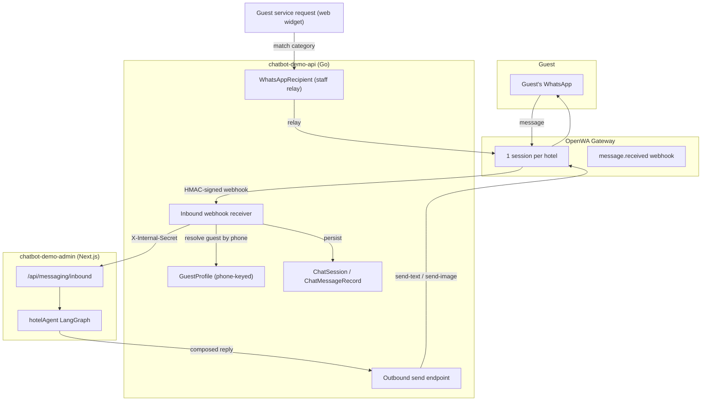

# WhatsApp Integration (OpenWA) — Staff Relay & Guest Concierge API

The **WhatsApp integration** connects a hotel's own WhatsApp number to the platform via
[OpenWA](https://github.com/rmyndharis/OpenWA) — a self-hosted, unofficial WhatsApp gateway
(`whatsapp-web.js` / `baileys` under the hood), not the official Meta Cloud API. It ships in two
genuinely separate subsystems that happen to share one connected number and one OpenWA session:

1. **Staff notification relay** (outbound only) — a guest's service request gets relayed to
   configured staff phones/groups over WhatsApp.
2. **Guest-facing concierge** (two-way) — a guest can message the hotel's number directly, or
   tap a Click-to-WhatsApp ad, and hold a real conversation with the same LangGraph agent the
   web widget uses.

> **Architecture decision record**: the full design rationale, options considered, and open
> questions live in `adr_whatsapp_openwa_integration.md` in this same folder. This document is
> the API/implementation reference; the ADR is the "why," including corrections made along the
> way and two real production incidents this build surfaced.

---

## Architecture Overview



Everything below OpenWA's own gateway is owned by exactly one Go service —
`chatbot-demo-api`. Neither the browser nor `chatbot-demo-admin` ever calls OpenWA directly;
every credential (`OPENWA_ADMIN_API_KEY`) and every session lives in `chatbot-demo-api` alone.

---

## 1. Staff Notification Relay (Outbound Only)

### 1.1 Connect Flow
* **Endpoint**: `POST /api/v1/properties/{id}/integrations/whatsapp/connect`
* **Auth**: Staff JWT + `whatsapp_enabled` entitlement (included on Engage/Inspire, purchasable
  as an add-on from Starter up).
* **Behavior**: Idempotent. Creates the property's OpenWA session on first call (adopts an
  existing same-name session on a `409` name conflict rather than failing), registers the
  inbound webhook (§3.1), then starts the session and returns its status.
* **Self-heal**: if the property has a saved `whatsapp_session_id` that OpenWA no longer
  recognizes (a real incident — see the ADR's risk register), this call detects the `404` via
  `GetSession`, clears `whatsapp_session_id`/`whatsapp_phone`/`whatsapp_webhook_secret`, and
  falls through to creating a fresh session instead of failing forever.
* **Response** (`200 OK`):
```json
{
  "success": true,
  "message": "WhatsApp connection started",
  "data": { "status": "qr_ready", "qr_code": "data:image/png;base64,..." }
}
```
`status` is one of `created | initializing | qr_ready | authenticating | ready | disconnected |
action_required | failed` — read live from OpenWA, never cached.

### 1.2 Status / Disconnect
* `GET /api/v1/properties/{id}/integrations/whatsapp/status` — polled by the dashboard modal
  every couple of seconds while connecting; caches only the phone number for display.
* `POST /api/v1/properties/{id}/integrations/whatsapp/disconnect` — unlinks the device (drops
  off the phone's Linked Devices list) but keeps the session record for reconnecting later.

### 1.3 Recipients (per-property, category-routed)
* `GET/POST /api/v1/properties/{id}/integrations/whatsapp/recipients`
* `PUT/DELETE /api/v1/properties/{id}/integrations/whatsapp/recipients/{recipientId}`
* `GET /api/v1/properties/{id}/integrations/whatsapp/groups` — lists the connected session's
  actual WhatsApp groups, so a manager can pick a group JID instead of typing one blind.

A `WhatsAppRecipient` row is `{label, chat_id, category}` — `chat_id` is a full JID
(`94771234567@c.us` for an individual, `120363...@g.us` for a group). `CreateServiceRequest`
(`controllers/request-controller/request_handlers.go`) matches a new service request's
category against this property's recipient rows and relays via `openwa.SendText` in a
fire-and-forget goroutine — a slow or failed WhatsApp send never blocks or fails the guest's
own request.

### 1.4 Usage & Billing
* `GET /api/v1/properties/{id}/integrations/whatsapp/usage` — notifications and guest messages
  used this billing period vs. limit.
* `PUT/POST /api/v1/admin/properties/{id}/integrations/whatsapp/usage-limits`,
  `.../usage/reset` — admin-only overrides.

Soft-cap billing, never blocks sending: `WhatsAppNotificationsUsed`/`WhatsAppGuestMessagesUsed`
on `Property`, reset monthly, overage tracked into `WhatsAppBillingPeriod` rows for manual
billing (`GET /api/v1/admin/billing/whatsapp-overages`). `CategoryNotification` increments on
every staff relay send; `CategoryGuestMessage` increments on every guest-facing send (§4) — one
increment per actual WhatsApp message sent, not per API call, so a 3-image reply counts as 3.

---

## 2. Guest-Facing Concierge (Two-Way)

### 2.1 Identity — phone-keyed, property-scoped
Every inbound message resolves to a `GuestProfile` row via
`FindOrCreateGuestByPhone(propertyID, phone)`
(`controllers/memory-controller/memory_handler.go`) — the **first real writer** `GuestProfile`
has ever had in this codebase (its only other write path, `BindSessionToGuest` /
`POST /api/memory/bind`, has zero callers anywhere in the actual guest-facing frontend — see
`memory_controller.md` §3 for that correction). Guarded by a partial unique index,
`(property_id, phone) WHERE phone <> ''`, race-safe under OpenWA's at-least-once webhook
delivery.

**Property-scoped, not global**: the same phone number messaging two different hotels resolves
to two completely separate `GuestProfile` rows. There is no cross-property guest concept
anywhere in this design.

### 2.2 Inbound webhook receiver
* **Endpoint**: `POST /api/v1/integrations/whatsapp/webhook/{sessionId}` — OpenWA's delivery
  target, registered automatically at connect-time (§1.1). Outside the staff `auth()` middleware
  entirely; authenticated by its own HMAC signature instead.
* **Signature verification**: `X-OpenWA-Signature: sha256=<hex>`, HMAC-SHA256 over the **raw**
  request body bytes, compared in constant time against the property's stored
  `whatsapp_webhook_secret` (generated once at first connect, never returned to the frontend).
* **Message-kind filtering**: only `kind === "individual"` is accepted (falls back to the older
  `isGroup` boolean only when `kind` is empty). Added after a real incident — a WhatsApp Channel
  broadcast arrived with `isGroup: false` and was originally accepted as a guest message,
  creating a fake profile and a failed agent-forward. `fromMe` (an echo of the property's own
  send) is also rejected.
* **Rate limiting** (`ratelimit.go`): fixed per-JID sliding window, 10 messages / 5 minutes
  (soft cap — one canned "slow down" reply, no agent forward) and 20 / 5 minutes (hard cap —
  silently dropped, no reply, nothing persisted). Both thresholds and the window are
  configurable via `WHATSAPP_RATE_LIMIT_SOFT_CAP` / `_HARD_CAP` / `_WINDOW_SECONDS`.
* **Per-thread serialization**: a `sync.Mutex` per `(property, phone)` (`threadLocks`) — a
  second message for the same guest arriving mid-turn blocks until the first message's full
  round trip (agent invoke → compose → send) has finished, closing a real race where two
  concurrent `hotelAgent.invoke()` calls against the same LangGraph `thread_id` could corrupt or
  drop one turn's checkpoint state.
* **Handover gate**: after persisting the message, the receiver checks the session's current
  `session_mode` (from `ChatSession`, keyed by the same `whatsapp-{propertyId}-{phone}` session
  key the agent uses as its `thread_id`). Anything other than `ai_active` — i.e.
  `handover_requested` or `human_active` — means the message is persisted but **never forwarded
  to the agent**. See §5.

### 2.3 Agent invocation
* **Endpoint**: `POST /api/messaging/inbound` on `chatbot-demo-admin` — deliberately
  channel-generic (not `/whatsapp/inbound`), so a future Messenger/Instagram DM receiver can
  normalize into the same shape and post to the same endpoint. Gated by `X-Internal-Secret`,
  the same shared secret used everywhere else in this codebase, just in the reverse direction
  (`chatbot-demo-api` calling into `chatbot-demo-admin` instead of the usual way around).
* Invokes the **same** `hotelAgent` graph the web widget uses (`src/lib/agent/graph.ts`),
  **non-streaming** (`.invoke()`, not `.streamEvents()`), with
  `configurable: { thread_id, propertyId }` where `thread_id = "whatsapp-{propertyId}-{phone}"`.
  Same router, same 15 live tools, same entitlement resolution as the web widget — zero new
  agent logic.
* **Request body** (from `chatbot-demo-api`):
```json
{ "channel": "whatsapp", "property_id": "...", "phone": "94771234567", "guest_id": "...", "text": "Do you have ocean view rooms?" }
```

### 2.4 Composer — what actually turns into images
Scans every `ToolMessage` in the graph's returned trajectory (not just the final reply — a
`__UI__{...}__UI__` payload is tool output, several turns back) for the image-bearing payload
types, and appends the AI's own final text as the closing message:

| Payload type | Composed as |
| :--- | :--- |
| `rooms`, `room_detail` | One `send-image` per room (photo + `name — price` caption), capped at 5 |
| `dining_menu`, `spa_treatment` | One `send-image` per item, same caption pattern |
| `personal_recommendation` | One `send-image` if the payload has one |
| Everything else (`preferences`, `booking_hold`, `outlets`, `itinerary`, …) | Plain text only — the AI's own prose reply, no fabricated numbered menu or location pins (designed, not yet built) |

### 2.5 Outbound send
* **Endpoint**: `POST /api/v1/properties/{id}/integrations/messaging/send` — channel-generic,
  gated by `X-Internal-Secret`.
* **Request body**:
```json
{
  "channel": "whatsapp",
  "chat_id": "94771234567@c.us",
  "items": [
    { "type": "image", "url": "https://.../ocean-suite.jpg", "caption": "Ocean Suite — USD 420/night" },
    { "type": "text", "text": "We have 3 ocean view rooms available for your dates..." }
  ]
}
```
* Dispatched **in order, synchronously** — a failure partway through the batch is reported
  (`items_sent` in the response tells the caller how much actually went out) rather than
  silently swallowed. `SendImage` passes the URL straight through to OpenWA (`{chatId, url,
  caption}`) — every image source in this codebase is already a public URL (`RoomType.HeroImageURL`
  etc.), so no download/re-upload step exists. `SendLocation`/`SendContact`/`SendPoll`/
  `SetTyping` are not implemented; base64 fallback for an unreachable URL is not implemented.

---

## 3. Webhook Registration (`pkg/openwa/webhooks.go`)

* `RegisterWebhook(sessionID, url, secret)` — `POST /api/sessions/:sessionId/webhooks` on
  OpenWA, subscribed to `message.received` only, HMAC secret ≥16 chars.
* `ListWebhooks(sessionID)` — checked before registering, so reconnecting an already-registered
  session doesn't create a duplicate (which would double-deliver every message).
* **SSRF guard**: OpenWA validates the callback URL at registration time and rejects a
  private/internal address unless it's in `SSRF_ALLOWED_HOSTS` on the OpenWA deployment's own
  config — real, hit once during setup when the callback URL resolved to a Docker-internal
  container address.
* `CHATBOT_ADMIN_BASE_URL` (env var, `chatbot-demo-api`) — where messages get forwarded (§2.3).
  Unset means guest-facing WhatsApp never receives anything; the staff relay (§1) is unaffected
  either way.

---

## 4. Usage Billing on the Guest Path

Every item actually sent over WhatsApp (§2.5) increments `WhatsAppGuestMessagesUsed` via
`RecordWhatsAppUsage(db, propertyID, CategoryGuestMessage, count)` — this is that counter's
first real writer; before this build it only ever existed as unused plumbing (see §1.4).

---

## 5. Human Handover Integration

`request_human_handover` (one of the agent's 15 live tools) behaves differently depending on
the `liveHandoverEnabled` entitlement, and only one of the two outcomes actually mutes the AI:

* **`status: "connecting"`** (Engage+ with live handover) — the tool's own turn still gets a
  normal reply ("connecting you now..."). *After* that reply is sent,
  `chatbot-demo-admin` calls the existing
  `POST /api/v1/properties/{id}/chat-sessions/{sessionKey}/request-handover` endpoint
  (documented in `live_chat_and_handover_websocket_api.md` §5.4) to flip `session_mode` to
  `handover_requested`. From the next inbound message onward, §2.2's handover gate stops
  forwarding to the agent.
* **`status: "logged"`** (Starter/Discover, no live handover) — the session mode is **never**
  touched. A Starter/Discover property has no way to ever call `handback` (it's gated behind the
  same entitlement as `takeover`), so muting the AI there would strand the guest permanently
  with nobody able to resume the conversation — checked and deliberately excluded.

**Resuming a muted WhatsApp session today requires a direct, staff-authenticated call** to
`POST /api/v1/properties/{id}/chat-sessions/{sessionKey}/handback` (§5.6 of the live-chat doc) —
there is no UI for this yet. A muted session's `sessionKey` is the same
`whatsapp-{propertyId}-{phone}` value used as the agent's `thread_id`.

`ChatSession.channel = "whatsapp"` — a value that existed in the schema for a long time with
zero writers — is finally populated on every real WhatsApp conversation, which is what makes
the (not-yet-built) Social Inbox page able to filter by channel at all.

---

## 6. Capacity Monitoring (unchanged, more load-bearing now)

`platform-controller/capacity_monitor.go` polls `GET /api/sessions/stats/overview` every 15
minutes, compares reported RSS against the container's configured memory cap, and raises a
`PlatformAlert` at 70%/85% (surfaced on the super-admin Platform Health page). Turning on
inbound traffic makes this more load-bearing than it was for the staff-relay-only phase — a
guest-facing channel needs the session to actually stay `ready`, not just idle.

---

## 7. Known Gaps (not yet built)

* **Conversation retention/summarization** — fully designed (10-day inactivity rolloff, LLM
  digest, raw checkpoint clear), zero implementation. Every WhatsApp thread accumulates
  `MemorySaver` checkpoint state indefinitely today.
* **Social Inbox page** — the largest remaining piece. §5's AI-mute works with no UI; resuming
  a session requires a direct API call.
* **Ad pre-fill deep-link generator + intent-clarification opener** — designed, not built.
* **`SendLocation`/`SendContact`/`SendPoll`/`SetTyping`** — not implemented; the payload types
  that would use them fall back to plain text (§2.4's table).
* **Image-send failure degradation** — a bad URL or oversized payload aborts the rest of that
  reply's item batch rather than falling back to a text description.

Full rationale and the two real production incidents (a dead OpenWA session after its data was
reset, and the channel-broadcast misclassification) are in `adr_whatsapp_openwa_integration.md`,
§12 (risk register) and §13 (rollout).
